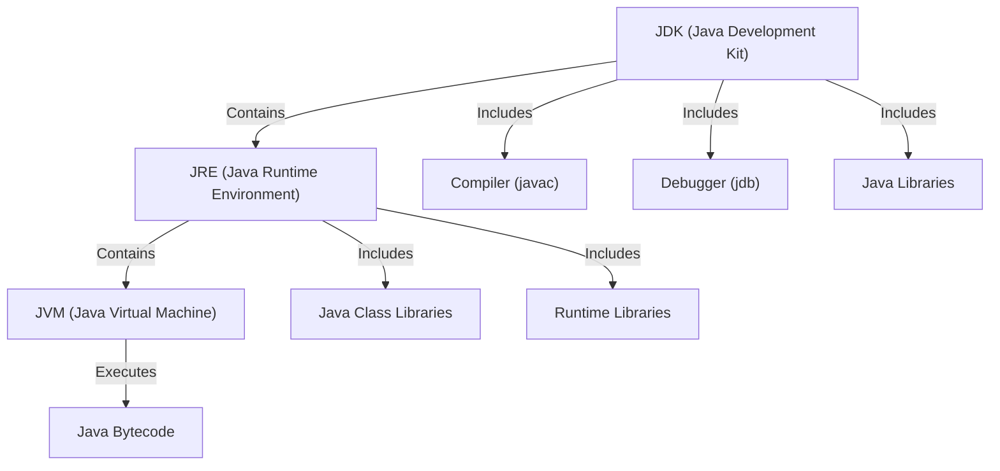
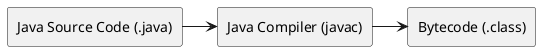

# Java Tutorial Notes

Java Tutorial Notes is a comprehensive reference guide designed to serve as a base language
reference and an interview preparation resource. This project provides structured explanations,
practical examples, and key concepts to help learners, developers and me to master Java efficiently.

Repository is based on [Java Masterclass 2025](https://www.udemy.com/course/java-the-complete-java-developer-course)
course by Tim Buchalka.

**Features**

* 📌 Concise explanations of Java fundamentals and advanced topics
* 💡 Hands-on code snippets to reinforce learning
* 🎯 Interview-focused content covering common questions and best practices
* 📚 Organized topic-wise structure for quick navigation

## ToDo List

- [ ] Where to place Operators in project layout.

Table of Contents
=================

- [Java Tutorial Notes](#java-tutorial-notes)
  - [ToDo List](#todo-list)
- [Table of Contents](#table-of-contents)
    - [ToDo List](#todo-list-1)
  - [Introduction to Java](#introduction-to-java)
  - [JDK / JRE / JVM](#jdk--jre--jvm)
  - [Manual Building](#manual-building)
  - [Maven and Gradle](#maven-and-gradle)
  - [Data Types](#data-types)
  - [Control Flow](#control-flow)
  - [Object Oriented Programming](#object-oriented-programming)
  - [Arrays](#arrays)
  - [Lists, ArrayList, LinkedList, Iterators, Autoboxing](#lists-arraylist-linkedlist-iterators-autoboxing)
  - [Abstraction in Java](#abstraction-in-java)

---

### ToDo List

* [ ] Where to place Operators in project layout?

---

## Introduction to Java

Java is a high-level, object-oriented, and platform-independent programming language. It was
developed by Sun Microsystems in 1995 and later acquired by Oracle Corporation. Java is widely used
for developing web applications, mobile applications, enterprise software, and embedded systems.

### Features 

* `Multiple inheritance` - Java doesn't support multiple inheritance through class. It can be achieved by using interfaces in java.
* `Platform-independent` - Java is platform-independent because it is compiled into an intermediate form called bytecode. This bytecode can be executed on any platform that has a Java Virtual Machine (JVM).
* `Operator Overloading` - Java does not support operator overloading.
* `Pointers` - Java does not support pointers.
* `Compiler and Interpreter` - Java is both compiled and interpreted. The Java compiler converts the source code into bytecode, and the JVM interprets the bytecode into machine code.
* `Call by reference / Value` - Java supports call by value only. There is no call by reference in java.
* `Iheritance` - Java always uses a single inheritance tree because all classes are the child of the Object class in Java. The Object class is the root of the inheritance tree in java.
* `Object-oriented` - Java is also an object-oriented language. However, everything (except fundamental types) is an object in Java. It is a single root hierarchy as everything gets derived from java.lang.Object.


## JDK / JRE / JVM

**TODO:** Update this page to reflect JDK/JRE/JVM relationship.




## Manual Building

### Compilation



To compile a Java program, you need to have the Java Development Kit (JDK) installed on your system.

```text
project/
│── src/
│   └── org/example/Main.java
└── target/ (this will store compiled classes)
```

```bash
javac -d target src/org/example/Main.java
```

When executing a Java class, the fully qualified class name (FQCN) should match its package structure ,
but it should not include the target/classes directory.

**FQCN** stands for Fully Qualified Class Name. It is the complete name of a class, including its package
or namespace, to uniquely identify it within a project.  
* `java.util.ArrayList` (instead of just `ArrayList`)


### Running Application

```bash
java -cp target/classes org.example.Main  
```

`-cp target/classes` sets the classpath to the compiled files.  
`org.example.Main` correctly represents the package and class name.  

https://www.javatpoint.com/internal-details-of-hello-java-program

## Maven and Gradle

## Data Types

## Control Flow

## Object Oriented Programming

## Arrays

## Lists, ArrayList, LinkedList, Iterators, Autoboxing

## Abstraction in Java


---

## Design Patterns 

[Python Design Pattern](https://www.javatpoint.com/singleton-design-pattern-in-python) For reference with more familiar programming language

[Java Design Patterns](https://www.javatpoint.com/design-patterns-in-java)


## Data Structures


