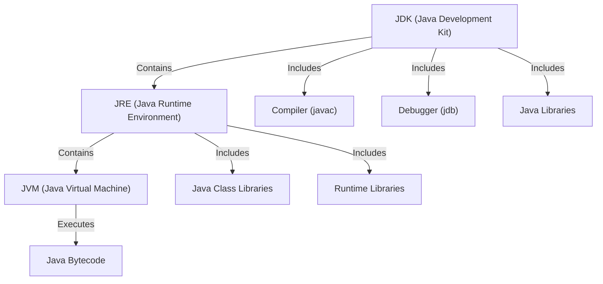
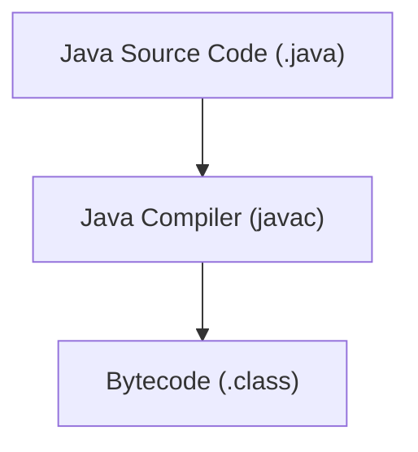
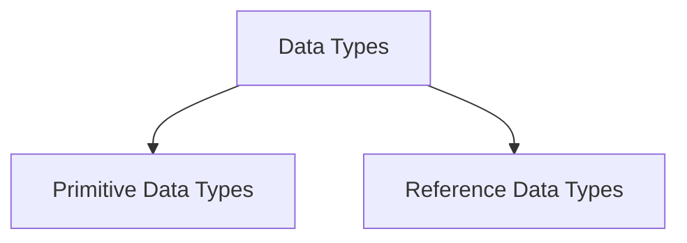

# Java Tutorial Notes

Java Tutorial Notes is a comprehensive reference guide designed to serve as a base
language reference and an interview preparation resource. This project provides
structured explanations, practical examples, and key concepts to help learners,
developers and me to master Java efficiently.

Repository is based
on [Java Masterclass 2025](https://www.udemy.com/course/java-the-complete-java-developer-course)
course by Tim Buchalka.

_Note: Readme line length in IntelliJ IDEA is fixed to 88 characters._ 

**Features**

* 📌 Concise explanations of Java fundamentals and advanced topics
* 💡 Hands-on code snippets to reinforce learning
* 🎯 Interview-focused content covering common questions and best practices
* 📚 Organized topic-wise structure for quick navigation

## ToDo List

- [ ] Where to place Operators in project layout.

Table of Contents
=================

<!-- TOC -->
* [Java Tutorial Notes](#java-tutorial-notes)
  * [ToDo List](#todo-list)
* [Table of Contents](#table-of-contents)
    * [ToDo List](#todo-list-1)
  * [Introduction to Java](#introduction-to-java)
    * [Features](#features)
  * [JDK / JRE / JVM](#jdk--jre--jvm)
    * [JVM - Java Virtual Machine](#jvm---java-virtual-machine)
    * [JRE - Java Runtime Environment](#jre---java-runtime-environment)
    * [JDK - Java Development Kit](#jdk---java-development-kit)
  * [Manual Building](#manual-building)
    * [Compilation](#compilation)
    * [Running Application](#running-application)
  * [Maven and Gradle](#maven-and-gradle)
  * [Java Memory Management](#java-memory-management)
  * [1. Data Types](#1-data-types)
    * [Primitive Data Types](#primitive-data-types)
    * [Reference Data Types](#reference-data-types)
    * [String Operations](#string-operations)
    * [Type casting](#type-casting)
    * [Autoboxing](#autoboxing)
  * [Control Flow](#control-flow)
  * [Object Oriented Programming](#object-oriented-programming)
  * [Arrays](#arrays)
  * [Lists, ArrayList, LinkedList, Iterators, Autoboxing](#lists-arraylist-linkedlist-iterators-autoboxing)
  * [Abstraction in Java](#abstraction-in-java)
  * [Design Patterns](#design-patterns)
  * [Data Structures](#data-structures)
<!-- TOC -->

---

### ToDo List

* [ ] Where to place Operators in project layout?

---

## Introduction to Java

Java is a high-level, object-oriented, and platform-independent programming language. It
was developed by Sun Microsystems in 1995 and later acquired by Oracle Corporation. Java
is widely used for developing web applications, mobile applications, enterprise
software, and embedded systems.

### Features

* `Multiple inheritance` - Java doesn't support multiple inheritance through class. It
  can be achieved by using interfaces in java.
* `Platform-independent` - Java is platform-independent because it is compiled into an
  intermediate form called bytecode. This bytecode can be executed on any platform that
  has a Java Virtual Machine (JVM).
* `Operator Overloading` - Java does not support operator overloading.
* `Pointers` - Java does not support pointers.
* `Compiler and Interpreter` - Java is both compiled and interpreted. The Java compiler
  converts the source code into bytecode, and the JVM interprets the bytecode into
  machine code.
* `Call by reference / Value` - Java supports call by value only. There is no call by
  reference in java.
* `Iheritance` - Java always uses a single inheritance tree because all classes are the
  child of the Object class in Java. The Object class is the root of the inheritance
  tree in java.
* `Object-oriented` - Java is also an object-oriented language. However, everything (
  except fundamental types)
  is an object in Java. It is a single root hierarchy as everything gets derived from
  java.lang.Object.

## JDK / JRE / JVM



### JVM - Java Virtual Machine

JVM (Java Virtual Machine) is an abstract machine. It is called a virtual machine
because it doesn't physically exist. It is a specification that provides a runtime
environment in which Java bytecode can be executed. It can also run those programs which
are written in other languages and compiled to Java bytecode.

JVMs are available for many hardware and software platforms. JVM, JRE, and JDK are
platform dependent because the configuration of each OS is different from each other.
However, Java is platform independent. There are three notions of
the JVM: specification, implementation, and instance.

The JVM performs the following main tasks:

* Loads code
* Verifies code
* Executes code
* Provides runtime environment

### JRE - Java Runtime Environment

The Java Runtime Environment (JRE) is a software package that provides the necessary
libraries and components to run Java applications. It includes the Java Virtual
Machine (JVM) and essential class libraries but **does not** include the compiler
(javac).

### JDK - Java Development Kit

The Java Development Kit (JDK) is a software development environment used for developing
Java applications and applets. It includes the Java Runtime Environment (JRE), an
interpreter/loader (Java), a compiler (javac), an archiver (jar), a documentation
generator (Javadoc), and other tools needed for Java development.  
Key Components of JDK:

* JRE (Java Runtime Environment): Provides libraries, Java Virtual Machine (JVM), and
  other components to run applications written in Java.
* Compiler (javac): Converts Java source code into bytecode.
* Debugger (jdb): Helps in debugging Java programs.
* Java Libraries: A set of libraries that provide reusable code for common tasks.

## Manual Building

### Compilation



To compile a Java program, you need to have the Java Development Kit (JDK) installed on
your system.

```text
project/
│── src/
│   └── org/example/Main.java
└── target/ (this will store compiled classes)
```

```bash
javac -d target src/org/example/Main.java
```

When executing a Java class, the fully qualified class name (FQCN) should match its
package structure, but it should not include the target/classes directory.

**FQCN** stands for Fully Qualified Class Name. It is the complete name of a class,
including its package or namespace, to uniquely identify it within a project.

* `java.util.ArrayList` (instead of just `ArrayList`)

### Running Application

```bash
java -cp target/classes org.example.Main  
```

`-cp target/classes` sets the classpath to the compiled files.  
`org.example.Main` correctly represents the package and class name.

## Maven and Gradle

## Java Memory Management

## 1. Data Types



### Primitive Data Types

Primitive types are predefined in Java and store simple values directly in memory.

| Data Type | Size    | Range               | Example                       |
|-----------|---------|---------------------|-------------------------------|
| `byte`    | 1 byte  | -128 to 127         | `byte b = 127;`               |
| `short`   | 2 bytes | -32,768 to 32,767   | `short s = 32000;`            |
| `int`     | 4 bytes | -2^31 to 2^31-1     | `int num = 100000;`           |
| `long`    | 8 bytes | -2^63 to 2^63-1     | `long bigNum = 10000000000L;` |
| `float`   | 4 bytes | ~6-7 decimal digits | `float f = 10.5f;`            |
| `double`  | 8 bytes | ~15 decimal digits  | `double d = 99.99;`           |
| `char`    | 2 bytes | Unicode characters  | `char c = 'A';`               |
| `boolean` | 1 bit   | `true` or `false`   | `boolean flag = true;`        |

### Reference Data Types

In Java, reference data types are types that refer to objects rather than storing the
actual value directly. They are created using constructors and are managed by the Java
garbage collector. Reference data types include classes, interfaces, arrays, and
enumerations. Key characteristics of reference data types:

* They store references (memory addresses) to the actual data.
* They can be used to create complex data structures like objects and arrays.
* They are created using the new keyword (except for strings, which can also be created
  using string literals).
* They are managed by the garbage collector, which automatically handles memory
  allocation
  and de-allocation.

| Type     | Example                         |
|----------|---------------------------------|
| `String` | `String text = "Hello, Java!";` |
| `Array`  | `int[] numbers = {1, 2, 3};`    |
| `Class`  | `Person p = new Person();`      |

### String Operations

**Is String Mutable in Java?**  
No, String is immutable in Java. This means that once a String object is created, its
value cannot be changed. Any modification to a String creates a new object rather than
changing the existing one.

Most usefully methods from String class. Note that variable `s` remains unchanged during
the exersice.

```java
public static void StringOperations() {
    String s = "Hello!";

    System.out.printf("Length: %d%n", s.length()); // 6
    System.out.printf("Index of 'l': %d%n", s.indexOf("l")); // 2

    System.out.printf("First character: %c%n", s.charAt(0)); // H
    System.out.printf("Replace 'H' with 'h': %s%n", s.replace("H", "h")); // hello!
    System.out.printf("Substring (0, 3): %s%n", s.substring(0, 3)); // Hel

    System.out.printf("Uppercase: %s%n", s.toUpperCase()); // HELLO!
    System.out.printf("Lowercase: %s%n", s.toLowerCase()); // hello!
}
```

### Type casting


byte → short → int → long → float → double

```java
public static void Casting() {

  // Expanding - Implicit Type Casting
  int a = 10;
  int b = a; // done automatically
  System.out.println(b);

  //Narrowing - Explicit Type Casting
  double c = 1;
  short d = (short) c;
  System.out.println(d);

}
```

### Autoboxing


## Control Flow

## Object Oriented Programming

## Arrays

## Lists, ArrayList, LinkedList, Iterators, Autoboxing

## Abstraction in Java

---

## Design Patterns

[Python Design Pattern](https://www.javatpoint.com/singleton-design-pattern-in-python)
For reference with more familiar programming language

[Java Design Patterns](https://www.javatpoint.com/design-patterns-in-java)

## Data Structures


